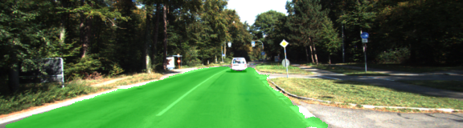
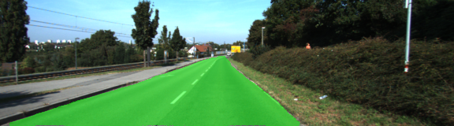
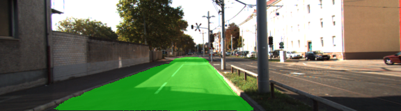

# Semantic Segmentation
### Introduction
In this project, the road in images is detected using a Fully Convolutional Network (FCN).

### Implementation
The functions in `main.py` are implemented to train a FCN. 

### Testing
The result of the FCN applied to the test dataset can be found `runs.zip`.

### Dataset
The training is performed on the [Kitti Road dataset](http://www.cvlibs.net/datasets/kitti/eval_road.php) which can be downloaded from [here](http://www.cvlibs.net/download.php?file=data_road.zip). 

The dataset needs to be extracted to the `data` folder in order to run the code. This will create the folder `data_road` with all the training a test images.

### Execution 
##### Frameworks and Packages
The following needs to be installed:
 - [Python 3](https://www.python.org/)
 - [TensorFlow](https://www.tensorflow.org/)
 - [NumPy](http://www.numpy.org/)

##### Run
Run the following command to run the project:
```
python main.py
```

### Sample images
All images can be found in `runs.zip`.
 
 
 
 
 
 
 
 
 
 
 

